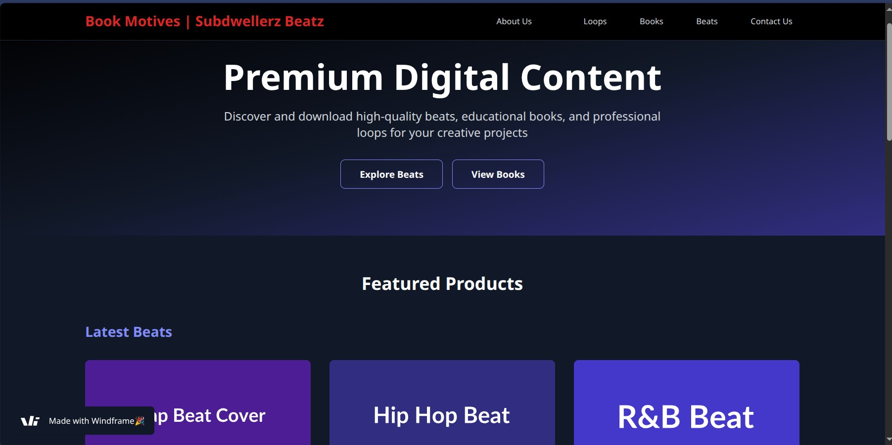

# Book Motives | Subdwellerz Beatz

A modern, responsive digital marketplace for premium music content including beats, educational books, and loop packages. Built with React, TypeScript, and Tailwind CSS.



## 🎵 About

**Book Motives | Subdwellerz Beatz** is a digital content platform designed for music producers, artists, and creators. We provide:

- **Premium Beats**: High-quality instrumentals across various genres (Trap, Hip Hop, R&B)
- **Educational Books**: Comprehensive guides on music production, beat making, and audio engineering
- **Loop Packages**: Professional-grade loops and samples for music production
- **MIDI Files**: Musical patterns and melodies for creative inspiration

## ✨ Features

- **Modern Design**: Sleek, dark-themed UI with gradient backgrounds and smooth animations
- **Responsive Layout**: Optimized for desktop, tablet, and mobile devices
- **Product Showcase**: Featured beats, books, and loop packages with preview functionality
- **Category Browsing**: Easy navigation between different content types
- **Newsletter Subscription**: Stay updated with latest releases and offers
- **Professional Licensing**: Various licensing options for commercial use

## 🛠️ Tech Stack

- **Frontend**: React 19.1.1 with TypeScript
- **Build Tool**: Vite 7.1.5
- **Styling**: Tailwind CSS 4.1.13
- **Routing**: React Router DOM 7.8.2
- **Code Quality**: ESLint with React-specific rules
- **Package Manager**: npm/yarn/pnpm/bun

## 🚀 Getting Started

### Prerequisites

- Node.js (version 18 or higher)
- npm, yarn, pnpm, or bun package manager

### Installation

1. **Clone the repository**
   ```bash
   git clone <repository-url>
   cd SubdwellerzBeatz/app
   ```

2. **Install dependencies**
   ```bash
   npm install
   # or
   yarn install
   # or
   pnpm install
   # or
   bun install
   ```

3. **Initialize git repository** (if needed)
   ```bash
   git init
   ```

4. **Start the development server**
   ```bash
   npm run dev
   # or
   yarn dev
   # or
   pnpm dev
   # or
   bun dev
   ```

5. **Open your browser**
   Navigate to `http://localhost:8000` to view the application

## 📁 Project Structure

```
app/
├── public/                 # Static assets
├── src/
│   ├── components/         # Reusable UI components
│   │   ├── Navbar.tsx     # Navigation bar
│   │   ├── HeroSection.tsx # Landing hero section
│   │   ├── FeaturedProducts.tsx # Product showcase
│   │   ├── SubscribeSection.tsx # Newsletter signup
│   │   └── Footer.tsx     # Footer component
│   ├── pages/             # Page components
│   │   └── index.tsx      # Main landing page
│   ├── index.css          # Global styles
│   └── main.tsx           # Application entry point
├── index.html             # HTML template
├── package.json           # Dependencies and scripts
├── vite.config.js         # Vite configuration
├── tsconfig.json          # TypeScript configuration
├── eslint.config.js       # ESLint configuration
└── README.md              # Project documentation
```

## 🎨 Components Overview

### Navbar
- Brand logo and navigation
- Responsive mobile menu
- Links to different content categories

### HeroSection
- Eye-catching gradient background
- Call-to-action buttons for beats and books
- Compelling tagline and description

### FeaturedProducts
- Showcases latest beats, educational books, and loop packages
- Product cards with images, descriptions, and pricing
- Preview and download buttons

### SubscribeSection
- Newsletter signup form
- Email capture for marketing campaigns

### Footer
- Additional navigation links
- Social media connections
- Copyright information

## 🎵 Product Categories

### Beats
- **Dark Trap Beat** - 130 BPM, High Quality WAV - $29.99
- **Urban Hip Hop** - 95 BPM, Stems Included - $39.99
- **Smooth R&B** - 75 BPM, Premium License - $49.99

### Educational Books
- **Music Production Mastery** - Complete production guide - $19.99
- **Beat Making Bible** - Beginner to professional - $24.99
- **Mixing & Mastering** - Professional audio techniques - $29.99

### Loop Packages
- **Trap Loops Pack Vol.1** - 50 High-Quality Loops - $15.99
- **Melodic Essentials** - 30 Melodic Loops & MIDI - $22.99
- **Drum Kit Collection** - 100 Drum Loops & One-shots - $18.99

## 📜 Available Scripts

- `npm run dev` - Start development server on port 8000
- `npm run build` - Build for production
- `npm run lint` - Run ESLint code analysis
- `npm run preview` - Preview production build locally

## 🔧 Configuration

### Vite Configuration
- Custom port configuration (8000)
- React plugin with Fast Refresh
- Tailwind CSS integration

### TypeScript
- Strict type checking enabled
- React-specific type definitions
- Modern ES module support

### ESLint
- React hooks rules
- React refresh rules
- Modern JavaScript standards

## 🚀 Deployment

1. **Build the application**
   ```bash
   npm run build
   ```

2. **Preview the build locally**
   ```bash
   npm run preview
   ```

3. **Deploy to your hosting platform**
   - The `dist` folder contains the production build
   - Compatible with Vercel, Netlify, GitHub Pages, etc.

## 📱 Browser Support

- Chrome (latest)
- Firefox (latest)
- Safari (latest)
- Edge (latest)
- Mobile browsers (iOS Safari, Chrome Mobile)

## 🤝 Contributing

1. Fork the repository
2. Create your feature branch (`git checkout -b feature/AmazingFeature`)
3. Commit your changes (`git commit -m 'Add some AmazingFeature'`)
4. Push to the branch (`git push origin feature/AmazingFeature`)
5. Open a Pull Request

## 📄 License

This project is licensed under the MIT License - see the [LICENSE](LICENSE) file for details.

## 📞 Contact

- **Website**: [Book Motives | Subdwellerz Beatz](https://subdwellerzbeatz.com)
- **Email**: contact@subdwellerzbeatz.com
- **Social Media**: Follow us for latest updates and releases

## 🎯 Future Enhancements

- [ ] User authentication and accounts
- [ ] Shopping cart functionality
- [ ] Payment integration (Stripe/PayPal)
- [ ] Audio preview player
- [ ] User reviews and ratings
- [ ] Advanced search and filtering
- [ ] Admin dashboard
- [ ] Mobile app development

---

**Built with ❤️ for the music production community**
